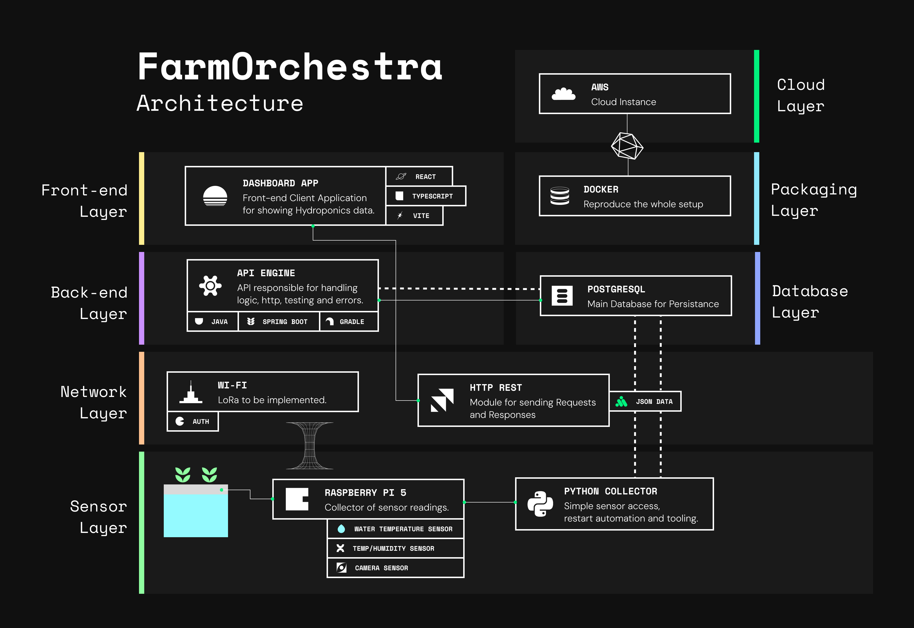

FarmOrchestra is an Open Source Hydroponics Monitoring System for growing your own food in a reliable way. 

It connects sensor readings from your indoor/outdoor farm setup (such as Hydroponics), with a dashboard to help you monitor under optimal growing conditions. 

The first prototype targets a simple deep-water culture (DWC) lettuce setup.

## Current Status 

Early dev.  

## Architecture [Work in Progress]

FarmOrchestra uses a monorepo containing the following applications: 
1. React Dashboard 
2. Java Spring Boot API 
3. Python Collector 

The collector runs on the Raspberry Pi and collects data from the sensors. These readings are persisted in a PostgreSQL database. Then the dashboard retrieves the data through the API. 

The next diagram shows the proposed MVP architecture. Some of the components listed are only planned, but not yet implemented.



[Download the architecture PDF](docs/architecture/architecture.pdf)

## Prerequisites 

- [Git](https://git-scm.com/install/) and [Make](https://formulae.brew.sh/formula/make) 
- Java 21 
- Node.js 24 LTS and `npm`
- [Vite](https://vite.dev)
- Python 3.12 and [uv](https://docs.astral.sh/uv/#installation)

## Quick Start 

Clone the repo with: 

```bash 
git clone git@github.com:julzdao/farmorchestra.git
cd farmorchestra
```

Install the necessary dependencies: 

```bash 
cd apps/dashboard 
npm install 
cd ../collector 
uv sync
```

Make sure to start each application in a separate terminal by running the following commands from the repository root: 

```bash 
make api
```

```bash 
make dashboard
```

```bash 
make collector
```

This should start the dashboard at `http://localhost:5173` and api at `http://localhost:8080`. 